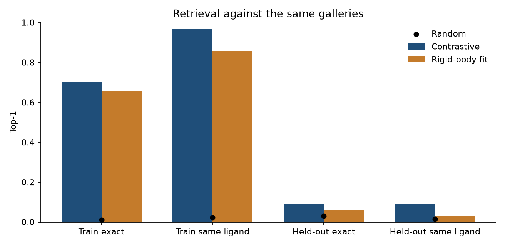
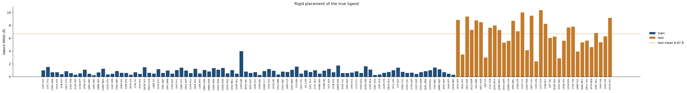

# Pocket contrastive learning

This repository trains two small models on public protein–ligand complexes from the PDB.

**Retrieval.** Each pocket and each ligand becomes one vector. Training pulls a pocket toward every ligand with the same residue name and away from the others. After training, a pocket ranks ligands by cosine similarity. The score is how often the top ligand has the right residue name.

**Coordinate denoising.** Ligand atom coordinates are shifted by random noise. A second network reads the noisy coordinates and the pocket vector, and predicts the clean coordinates. The score is the RMSD after the two point clouds are aligned.

The set has 124 complexes. Ninety fit the models. Thirty-four are held out by protein: a test PDB never appears in a training step. Ligand residue names were read from the deposited PDB files. Where one protein has several entries, those entries stay in the same split.

```bash
pip install torch biopython numpy matplotlib pandas
python train_demo.py
```

The first run downloads structures from RCSB into `data/raw/`. That directory is gitignored. If a direct download fails, the loader retries through `https_proxy` or `http://127.0.0.1:7897`. Training uses CUDA when it is available, then Apple Metal, then CPU.

Defaults are 800 retrieval steps, learning rate `3e-4`, and seed 0. Denoising steps default to 12 times the number of training complexes.

## How a complex is read

A PDB file often contains several copies of one ligand. The loader keeps a single residue with the requested name and at least five heavy atoms, choosing the copy with the most heavy atoms. The pocket is the standard residues whose Cα lies within 8 Å of any of those ligand atoms.

Pocket nodes are a 21-way amino-acid encoding plus hydrophobicity, charge, polarity, and volume. Ligand nodes are a six-way element encoding (`C`, `N`, `O`, `S`, `P`, other). Ligand coordinates are centered. Edges connect pocket Cα atoms within 10 Å, and ligand atoms within 2.2 Å.

`1HWK` is the atorvastatin complex. The statin is residue `117`. ADP in that file is a cofactor and is not the ligand used here.

## Models

Each encoder is a two-layer mean-aggregation network. A node carries its label plus its number of neighbors. An edge carries a distance basis. Pocket Cα edges use distances up to 10 Å, and ligand edges use distances up to 2.2 Å. The graph vector is the mean node, the max node, the log of the number of nodes, and a 16-bin histogram of pairwise distances, then L2-normalized to 64 dimensions.

Retrieval uses a symmetric multi-positive InfoNCE loss at temperature 0.07. Every ligand with the same residue name is a positive, so a second ATP crystal is not a negative. Gradients are clipped at 1.0. Each retrieval step uses the full training set as one batch.

An earlier version averaged the labels and ignored distances and atom counts, and it treated every crystal as its own class. Different ligands then collapsed to similar vectors, and copies of ATP were pushed apart. That run did not fit the 90 training pairs.

`rigid_matcher.py` trains a rigid placement. The pocket and the ligand are each written in a local frame. A network predicts one rotation and one translation and applies that motion to the ligand, leaving its internal geometry unchanged. A second network scores the contacts of the placed ligand. Positives again share a residue name. The pose is trained for 100 epochs and the score for 240.

The denoiser is an MLP. Its input is the ligand element, the noisy coordinates, the noise scale in angstroms, and the frozen pocket vector. It predicts the clean coordinates. Training adds `Uniform(0.1, 2.0)` Å of noise. Sampling starts from random coordinates and replaces them at 2.0, 1.0, 0.5, and 0.2 Å. The reported error is a Kabsch RMSD after centering both point clouds.

```
models/retriever.pt
models/denoiser.pt
models/rigid.pt
models/metrics.json
```

## Results

The contrastive numbers use seed 0, 800 retrieval steps, and 1080 denoising steps. The rigid numbers use the same split, with 100 pose epochs and 240 score epochs. The training script uses CUDA when it is available, then Apple Metal, then CPU.

On the 90 training complexes, contrastive retrieval ranks a ligand with the right residue name first for 87/90 pockets. The exact crystal is first for 63/90. Several training ligands share a residue name, so those two counts differ. A random top hit would match the residue name about 2 times in 90, and the exact crystal about 1 time in 90.

On the 34 held-out pockets, exact top-1 inside the test gallery is 3/34. A random guess among those 34 ligands would be right about 1 time in 34. Against all 124 ligands, the same-ligand top-1 is 3/34. `1IEP` (Abl, STI) ranks the training imatinib `1XBB` first. `1X70` and `1QS4` rank their own crystals first. The mean exact rank in the gallery of 124 is 50. A random rank would average about 62.

On the 90 training complexes, the trained rigid model places the true ligand at a mean RMSD of 0.83 Å. It ranks a ligand with the right residue name first for 77/90 pockets, and the exact crystal first for 59/90.

On the 34 held-out pockets, rigid exact top-1 inside the test gallery is 2/34. Against all 124 ligands, the same-ligand top-1 is 1/34: `1C83` ranks its own ligand first. The mean exact rank is 56. The mean placement RMSD on these held-out ligands is 6.67 Å.

Contrastive retrieval fits more of the training names (87/90) and ranks 3/34 held-out pockets by the right residue name, with mean exact rank 50. The rigid model is the one that recovers training poses.

Mean Kabsch RMSD of the denoiser is 4.60 Å on the training complexes and 4.38 Å on the held-out complexes.

In the loss figure, the pale line is the loss at each step. The dark line is a moving average: 25 steps for retrieval and 60 steps for coordinate denoising.







### Held-out complexes

Ranks are positions in the gallery of 124. Lower is better.

| PDB | Code | Protein | Contrastive rank | Contrastive top | Rigid rank | Rigid top | Rigid RMSD (Å) | Denoiser RMSD (Å) |
| --- | --- | --- | --- | --- | --- | --- | --- | --- |
| 1DV2 | ATP | biotin carboxylase | 16 | 1MBN HEM | 33 | 2C6O 4SP | 8.86 | 4.68 |
| 1KAX | ATP | Hsp70 | 8 | 1GP2 GDP | 57 | 1O6K ANP | 3.45 | 4.98 |
| 1BG2 | ADP | kinesin | 9 | 121P GCP | 9 | 1DV2 ATP | 9.38 | 3.98 |
| 1ECD | HEM | erythrocruorin | 50 | 1I7I AZ2 | 104 | 1O86 LPR | 7.30 | 4.87 |
| 1IR3 | ANP | insulin receptor kinase | 29 | 1DB1 VDX | 55 | 2RFS AM8 | 8.78 | 4.53 |
| 1M17 | AQ4 | EGFR kinase | 56 | 1Y6A AAZ | 90 | 1AGW SU2 | 8.49 | 5.26 |
| 1IEP | STI | Abl kinase | 6 | 1XBB STI | 38 | 1QS4 100 | 2.99 | 6.73 |
| 1CX2 | S58 | COX-2 | 93 | 1F88 RET | 102 | 1BYQ ADP | 7.63 | 4.45 |
| 4DFR | MTX | dihydrofolate reductase | 116 | 1OYN ROL | 96 | 1OYN ROL | 7.99 | 4.96 |
| 1DWD | MID | thrombin | 103 | 1CSB EP0 | 33 | 2YDO ADN | 7.27 | 4.42 |
| 3HS4 | AZM | carbonic anhydrase II | 75 | 1HRC HEC | 74 | 1ICE ASA | 5.32 | 2.96 |
| 2QWK | G39 | neuraminidase | 44 | 5TMN 0PJ | 57 | 1FTN GDP | 5.59 | 3.18 |
| 2PRG | BRL | PPAR gamma | 16 | 1I7I AZ2 | 7 | 1UWH BAX | 8.70 | 4.76 |
| 1O86 | LPR | ACE | 97 | 1XWS BI1 | 99 | 1CKP PVB | 7.08 | 4.67 |
| 1X70 | 715 | DPP-4 | 1 | 1X70 715 | 100 | 1A49 ATP | 10.02 | 5.09 |
| 1UK0 | FRM | PARP | 66 | 1CX2 S58 | 121 | 1ICE ASA | 4.12 | 5.06 |
| 1W51 | L01 | BACE | 25 | 1I10 NAI | 111 | 1MMD ADP | 9.50 | 5.26 |
| 1C83 | OAI | PTP1B | 7 | 2RH1 CAU | 1 | 1C83 OAI | 2.38 | 3.42 |
| 121P | GCP | H-Ras | 7 | 1GP2 GDP | 14 | 2SRC ANP | 10.38 | 4.81 |
| 1F88 | RET | rhodopsin | 80 | 1FBY 9CR | 83 | 1PY5 PY1 | 8.24 | 4.21 |
| 1JFF | TA1 | tubulin | 14 | 1KZN CBN | 104 | 1C14 TCL | 6.06 | 5.21 |
| 3EQM | ASD | aromatase | 75 | 4DFR MTX | 29 | 1HHO HEM | 6.26 | 3.64 |
| 2V5Z | SAG | monoamine oxidase B | 74 | 1ERE EST | 2 | 1W0E MET | 2.86 | 4.85 |
| 1KSN | FXV | factor Xa | 120 | 1X70 715 | 57 | 1AKE AP5 | 5.60 | 5.37 |
| 1GFW | MSI | caspase-3 | 79 | 1PGG IMM | 83 | 1VID DNC | 7.68 | 4.16 |
| 1T64 | TSN | HDAC | 29 | 1W0E MET | 40 | 2QWK G39 | 7.81 | 4.36 |
| 2AM9 | TES | androgen receptor | 6 | 3EML ZMA | 96 | 1IEP STI | 3.91 | 3.44 |
| 1W0E | MET | CYP3A4 | 10 | 1EL3 I84 | 4 | 1ZIN AP5 | 5.36 | 1.92 |
| 2RH1 | CAU | beta2 adrenergic receptor | 104 | 3EML ZMA | 14 | 2B7A IZA | 5.62 | 3.98 |
| 3PTB | BEN | trypsin | 12 | 1CSB EP0 | 27 | 1VID DNC | 4.61 | 1.85 |
| 1HRC | HEC | cytochrome c | 104 | 1ERR RAL | 20 | 1FK9 EFZ | 6.82 | 5.09 |
| 2H42 | VIA | PDE5 | 91 | 1KSN FXV | 67 | 2QWK G39 | 5.37 | 4.52 |
| 1QS4 | 100 | HIV integrase | 1 | 1QS4 100 | 31 | 1VID DNC | 6.30 | 3.83 |
| 2OC8 | U5G | HCV protease | 93 | 2B7A IZA | 57 | 1CKP PVB | 9.17 | 4.49 |

The same rows are in `data/processed/heldout_results.csv`.

### Training complexes

| PDB | Code | Protein |
| --- | --- | --- |
| 1ATP | ATP | cAMP-dependent protein kinase |
| 1STC | STU | cAMP-dependent protein kinase |
| 1FMO | ADN | cAMP-dependent protein kinase |
| 1HCK | ATP | cyclin-dependent kinase 2 |
| 1FIN | ATP | cyclin-dependent kinase 2 |
| 1AQ1 | STU | cyclin-dependent kinase 2 |
| 1CKP | PVB | cyclin-dependent kinase 2 |
| 2C6O | 4SP | cyclin-dependent kinase 2 |
| 1CSN | ATP | casein kinase 1 |
| 1PHK | ATP | phosphorylase kinase |
| 1JWH | ANP | casein kinase 2 |
| 1A9U | SB2 | p38 MAP kinase |
| 1BMK | SB5 | p38 MAP kinase |
| 1UWH | BAX | B-Raf |
| 1Q3D | STU | GSK3 |
| 1Q41 | IXM | GSK3 |
| 1O6K | ANP | AKT |
| 1XWS | BI1 | Pim-1 |
| 1QPE | PP2 | Lck |
| 2B7A | IZA | JAK2 |
| 1T46 | STI | Kit |
| 2FGI | PD1 | FGFR1 |
| 1AGW | SU2 | FGFR1 |
| 1NVQ | UCN | Chk1 |
| 1XBB | STI | Syk |
| 1U59 | STU | ZAP-70 |
| 2SRC | ANP | Src |
| 2RFS | AM8 | c-Met |
| 1Y6A | AAZ | VEGFR2 |
| 1PY5 | PY1 | TGF-beta receptor |
| 1SM2 | STU | Itk |
| 1BYQ | ADP | Hsp90 |
| 1UY6 | PU3 | Hsp90 |
| 1AKE | AP5 | adenylate kinase |
| 1ZIN | AP5 | adenylate kinase |
| 1MBO | HEM | myoglobin |
| 1MBN | HEM | myoglobin |
| 1HDA | HEM | hemoglobin |
| 1HHO | HEM | hemoglobin |
| 2HHB | HEM | hemoglobin |
| 2HCK | QUE | Src-family kinase Hck |
| 1HSG | MK1 | HIV protease |
| 1HVR | XK2 | HIV protease |
| 1HPX | KNI | HIV protease |
| 4PHV | VAC | HIV protease |
| 3ERT | OHT | estrogen receptor |
| 1ERE | EST | estrogen receptor |
| 1ERR | RAL | estrogen receptor |
| 1HWK | 117 | HMG-CoA reductase |
| 1EVE | E20 | acetylcholinesterase |
| 1EQG | IBP | COX-1 |
| 1PGG | IMM | COX-1 |
| 1OG5 | SWF | CYP2C9 |
| 1R9O | FLP | CYP2C9 |
| 1HDX | NAD | alcohol dehydrogenase |
| 1I10 | NAI | lactate dehydrogenase |
| 1AH3 | TOL | aldose reductase |
| 1EL3 | I84 | aldose reductase |
| 1HFC | PLH | matrix metalloproteinase |
| 1CGL | 0ED | collagenase |
| 4TMN | 0PK | thermolysin |
| 5TMN | 0PJ | thermolysin |
| 1ICE | ASA | caspase-1 |
| 1CSB | EP0 | cathepsin B |
| 1MEM | 0D6 | cathepsin K |
| 2V0Z | C41 | renin |
| 1VRT | NVP | HIV reverse transcriptase |
| 1FK9 | EFZ | HIV reverse transcriptase |
| 1C14 | TCL | enoyl-ACP reductase |
| 1P44 | GEQ | InhA |
| 1KZN | CBN | DNA gyrase |
| 1CBS | REA | CRABP |
| 1DB1 | VDX | vitamin D receptor |
| 1FBY | 9CR | RXR |
| 1A28 | STR | progesterone receptor |
| 1M2Z | DEX | glucocorticoid receptor |
| 1K7L | 544 | PPAR alpha |
| 1I7I | AZ2 | PPAR delta |
| 1P8D | CO1 | LXR |
| 1OSV | CHC | FXR |
| 1FTN | GDP | RhoA |
| 1GP2 | GDP | G protein alpha |
| 2YDO | ADN | adenosine A2A receptor |
| 3EML | ZMA | adenosine A2A receptor |
| 1OYN | ROL | PDE4 |
| 1VID | DNC | COMT |
| 1MMD | ADP | myosin |
| 4PFK | ADP | phosphofructokinase |
| 1A49 | ATP | pyruvate kinase |
| 1QHA | ANP | aspartate carbamoyltransferase |

## Binding-site pairs

`data_preparation.py`, `train.py`, `evaluate.py`, and `demo.py` are an older site-versus-site example. Positive pairs share a ligand residue name. Pairs are built inside one split, so a test protein does not appear in `train.csv` or `val.csv`. `val.csv` is a pair split of the training proteins. The held-out numbers above come from `train_demo.py`.

`train.py` needs PyTorch Geometric as well as PyTorch. If `pip install -r requirements.txt` fails on `torch-geometric`, `torch-scatter`, or `torch-sparse`, use the wheel command from the [PyG install page](https://pytorch-geometric.readthedocs.io/en/latest/install/installation.html).

```bash
python data_preparation.py
python train.py --epochs 50 --batch_size 8
python evaluate.py --checkpoint checkpoints/best_model.pt
```

## Scope

The code in this repository trains only on the public structures listed above. Contrastive retrieval fits the training residue names. The rigid model fits the training poses, with mean RMSD 0.83 Å, and ranks the training residue name first for 77/90 pockets. Held-out placement stays near 6.7 Å, and held-out ranking stays close to a random guess for both methods. The RMSD near 4.4 Å is the coordinate error of the denoiser.
