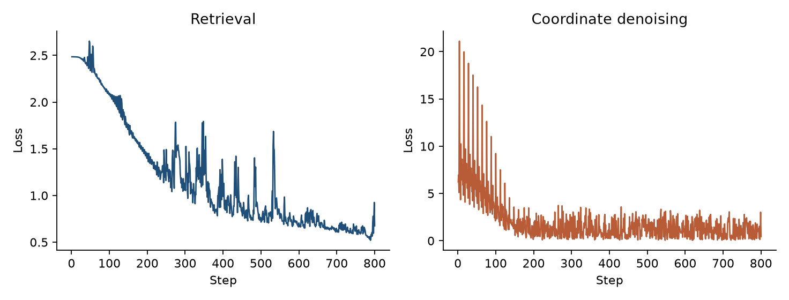
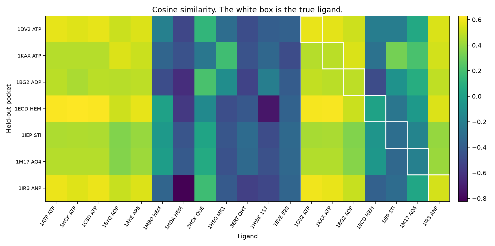
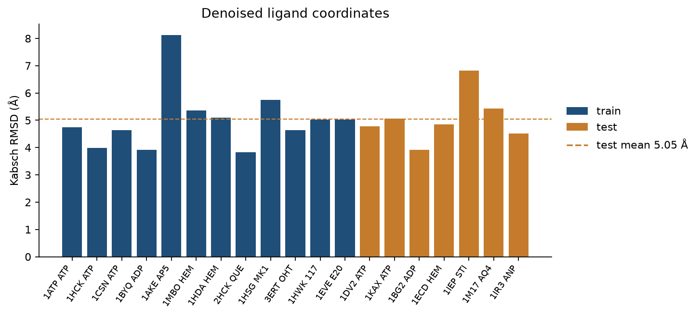

# Pocket contrastive learning

A small PyTorch example of two tasks on public PDB complexes:

- contrastive retrieval, where a pocket embedding should rank its own ligand above the other ligands
- pocket-conditioned denoising, where ligand coordinates are rebuilt from noise

Nineteen complexes are used. Twelve fit the models. Seven are held out by whole protein: those PDB entries never appear in a training step. Ligand residue names were read from the PDB files.

```bash
pip install torch biopython numpy matplotlib pandas
python train_demo.py
```

The first run downloads structures from RCSB into `data/raw/`. That directory is gitignored. Training uses CUDA when it is available, otherwise CPU. Defaults are 800 retrieval steps, 800 denoising steps, learning rate `3e-4`, and seed 0.

```bash
python train_demo.py --retrieval-steps 800 --generation-steps 800 --lr 3e-4 --seed 0
```

## Complexes

| PDB | Code | Molecule | Protein | Split |
| --- | --- | --- | --- | --- |
| 1ATP | ATP | ATP | cAMP-dependent protein kinase | train |
| 1HCK | ATP | ATP | cyclin-dependent kinase 2 | train |
| 1CSN | ATP | ATP | casein kinase 1 | train |
| 1BYQ | ADP | ADP | Hsp90 | train |
| 1AKE | AP5 | Ap5A | adenylate kinase | train |
| 1MBO | HEM | heme | myoglobin | train |
| 1HDA | HEM | heme | hemoglobin | train |
| 2HCK | QUE | quercetin | Src-family kinase Hck | train |
| 1HSG | MK1 | indinavir | HIV protease | train |
| 3ERT | OHT | 4-hydroxytamoxifen | estrogen receptor | train |
| 1HWK | 117 | atorvastatin | HMG-CoA reductase | train |
| 1EVE | E20 | donepezil | acetylcholinesterase | train |
| 1DV2 | ATP | ATP | biotin carboxylase | test |
| 1KAX | ATP | ATP | Hsp70 | test |
| 1BG2 | ADP | ADP | kinesin | test |
| 1ECD | HEM | heme | erythrocruorin | test |
| 1IEP | STI | imatinib | Abl kinase | test |
| 1M17 | AQ4 | erlotinib | EGFR kinase | test |
| 1IR3 | ANP | AMP-PNP | insulin receptor kinase | test |

`1HWK` is the atorvastatin complex. The statin is residue `117`. ADP is also in that file, as a cofactor, and is not the ligand used here. `3LZA`, `4AKE`, `1ALC`, and `1TRZ` are not in the list: those files do not contain the ligands an earlier version of this repository named.

A PDB file often contains several copies of one ligand. The loader keeps a single residue with the requested name and at least five heavy atoms, choosing the copy with the most heavy atoms. The pocket is the standard residues whose Cα lies within 8 Å of any of those ligand atoms. A pocket with fewer than eight residues is rejected.

Pocket nodes are a 21-way amino-acid encoding plus hydrophobicity, charge, polarity, and volume. Ligand nodes are a six-way element encoding (`C`, `N`, `O`, `S`, `P`, other). Fluorine in atorvastatin and chlorine in erlotinib fall in the other bin. Ligand coordinates are centered. Edges connect pocket Cα atoms within 10 Å, and ligand atoms within 2.2 Å.

## Models

Each encoder is a two-layer mean-aggregation network with a 64-dimensional L2-normalized readout. Retrieval uses symmetric InfoNCE at temperature 0.07, so each pocket is trained to match its own ligand and each ligand is trained to match its own pocket. Gradients are clipped at 1.0.

The denoiser is an MLP. Its input is the ligand element, the noisy coordinates, the noise scale in angstroms, and the frozen pocket vector. It predicts the clean coordinates. Training adds `Uniform(0.1, 2.0)` Å of noise. Sampling starts from random coordinates and replaces them at 2.0, 1.0, 0.5, and 0.2 Å. The reported error is a Kabsch RMSD after centering both point clouds.

Saved weights and the numbers below are in `models/`:

```
models/retriever.pt
models/denoiser.pt
models/metrics.json
```

## One CPU run

Seed 0, 800 steps for each task. On the 12 training ligands, exact top-1 is 10/12. The two misses are `1ATP`, whose top hit is `1BYQ` ADP, and `1CSN`, whose top hit is the other training ATP, `1ATP`.

On the seven held-out pockets, exact top-1 inside the test gallery is 1/7. That is the rate of picking one ligand out of seven at random. Against all 19 ligands, the same-ligand top-1 is also 1/7. The only held-out pocket that ranks its own ligand first is `1DV2`.

| Held-out PDB | Ligand | Exact rank in 19 | Top hit | RMSD (Å) |
| --- | --- | --- | --- | --- |
| 1DV2 | ATP | 1 | 1DV2 ATP | 4.78 |
| 1KAX | ATP | 5 | 1BYQ ADP | 5.05 |
| 1BG2 | ADP | 4 | 1DV2 ATP | 3.92 |
| 1ECD | HEM | 10 | 1HCK ATP | 4.85 |
| 1IEP | STI | 14 | 1HCK ATP | 6.82 |
| 1M17 | AQ4 | 13 | 1HCK ATP | 5.42 |
| 1IR3 | ANP | 7 | 1DV2 ATP | 4.52 |

Mean Kabsch RMSD is 5.01 Å on the training complexes and 5.05 Å on the held-out complexes.







The per-complex held-out table is also written to `data/processed/heldout_results.csv`.

## Binding-site pairs

`data_preparation.py`, `train.py`, `evaluate.py`, and `demo.py` are an older site-versus-site example. Positive pairs share a ligand residue name. Pairs are built inside one split, so a test protein does not appear in `train.csv` or `val.csv`. `val.csv` is a pair split of the training proteins, so those proteins are still seen during a training run of `train.py`. The held-out numbers above come from `train_demo.py`.

`train.py` needs PyTorch Geometric as well as PyTorch. `torch-geometric`, `torch-scatter`, and `torch-sparse` must match the installed PyTorch build. If `pip install -r requirements.txt` fails on those three packages, use the wheel command from the [PyG install page](https://pytorch-geometric.readthedocs.io/en/latest/install/installation.html).

```bash
python data_preparation.py
python train.py --epochs 50 --batch_size 8
python evaluate.py --checkpoint checkpoints/best_model.pt
```

In that older model each residue is a node with the 25 pocket features above. Edges connect Cα atoms within 10 Å and carry distance and direction. The encoder is a 3-layer graph attention network with 4 heads. Mean and max pooling are projected to a 256-dimensional L2-normalized vector. The loss is InfoNCE with temperature 0.07.

## Scope

The code in this repository trains only on the public structures listed above. The training-set top-1 shows that the retrieval loop can fit those twelve pairs. The held-out top-1 shows that this fit does not transfer to the seven new complexes. The RMSD check shows that the denoiser runs; an error near 5 Å is not a docked pose.
